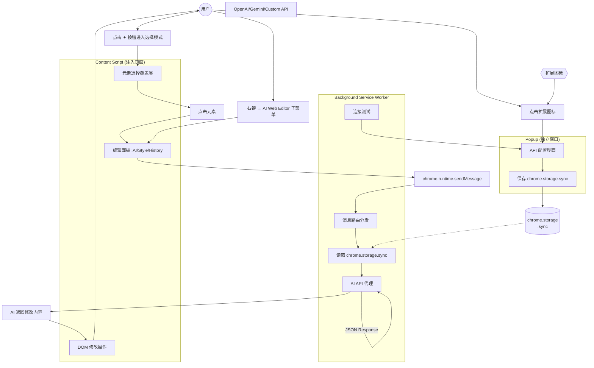
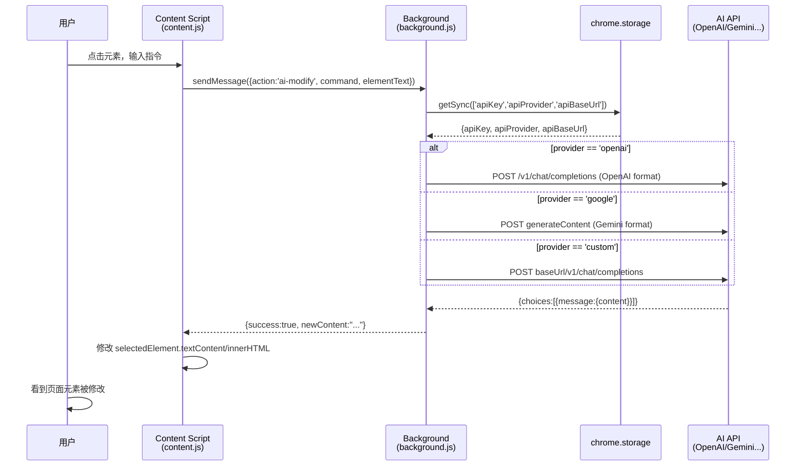
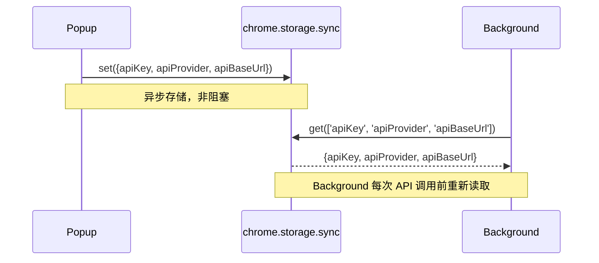

# 系统架构

## 概述

AI Web Editor 是一个 Chrome Manifest V3 扩展，由三个核心组件构成：

1. **Background Service Worker** — 后端 API 代理，负责与 AI 模型通信
2. **Content Script** — 注入页面 DOM，提供元素选择和编辑面板
3. **Popup** — 用户配置入口（API Key、Provider、Base URL）

三者在 Chrome Extension 生命周期中独立运行，通过 `chrome.storage.sync` 和 `chrome.runtime.sendMessage` 通信。

## 系统流程图



## 通信机制

### 消息传递链路



### 配置同步机制



## CSP 策略

```json
{
  "content_security_policy": {
    "extension_pages": "script-src 'self'; object-src 'self'; connect-src https://*.openai.com https://api.openai.com https://generativelanguage.googleapis.com http://localhost:* http://127.0.0.1:*; img-src 'self' data: blob:;"
  }
}
```

- `connect-src` 允许 OpenAI、Google Gemini、以及本地 API（Ollama/LM Studio/vLLM）
- 通过通配符 `http://localhost:*` 和 `http://127.0.0.1:*` 支持任意端口的本地模型服务

## 关键设计决策

| 决策 | 原因 |
|------|------|
| Manifest V3 | Chrome 已弃用 MV2，V3 使用 Service Worker（非持久化） |
| Vanilla JS 无构建 | 简化安装流程，直接加载 src/ 目录即可调试 |
| Background 代理 API | Content Script 不能直接调用 AI API（CSP + CORS），必须经 Service Worker |
| `.awe-` CSS 前缀 | 避免注入的样式与页面原有样式冲突 |
| `chrome.storage.sync` 共享配置 | Popup 和 Background 都在同一个扩展上下文中，sync storage 是跨组件共享状态的标准方式 |

## 数据流总结

1. **配置**：Popup 保存 → `chrome.storage.sync` ← Background 读取 → AI API 调用
2. **编辑**：Content Script 选择元素 → `sendMessage('ai-modify')` → Background → AI API → 返回结果 → Content Script 修改 DOM
3. **样式**：Content Script 直接操作 `element.style.*`（无需后台）
4. **历史**：Content Script 内存中维护 historyStore 数组，session 生命周期内有效
